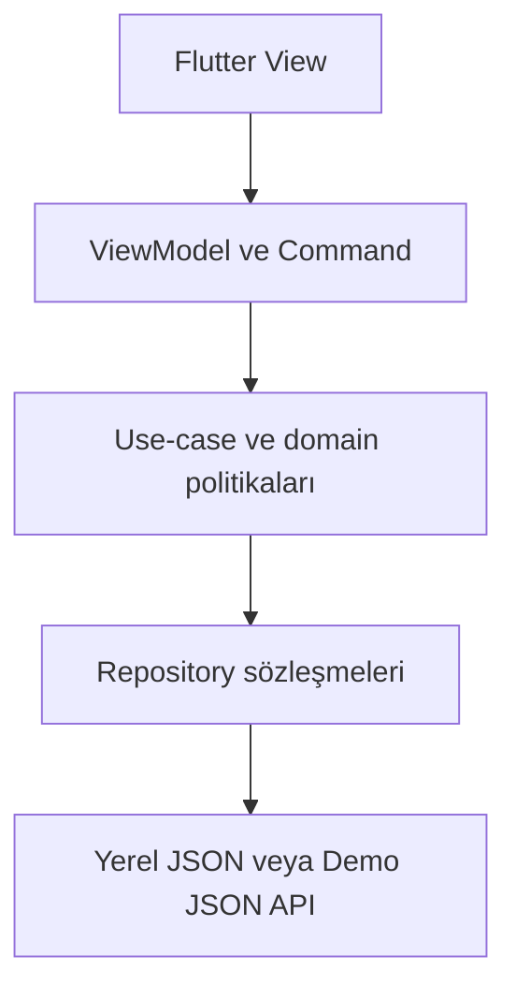
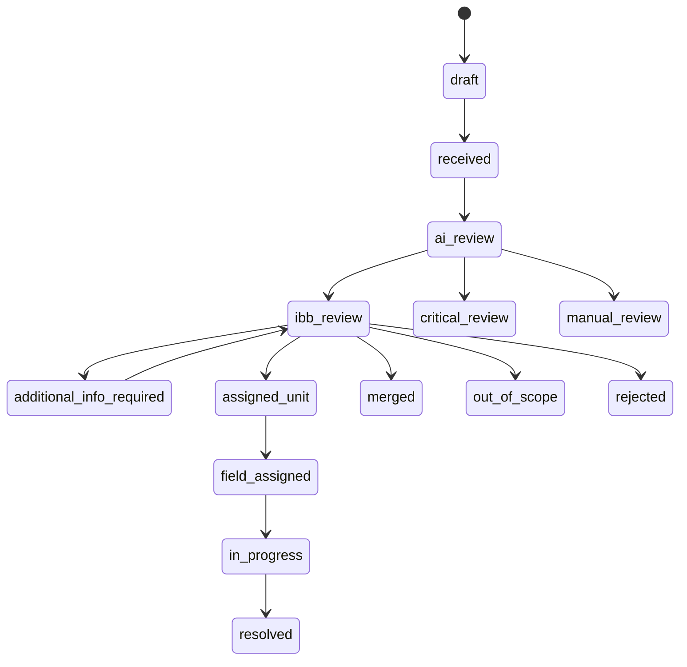
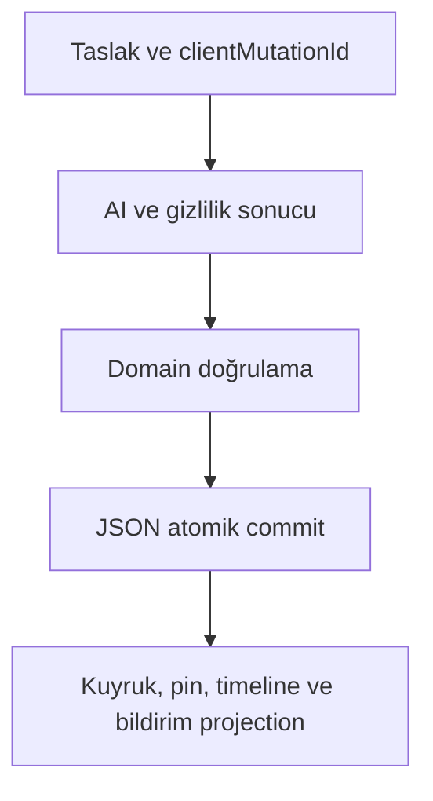

# İBB Kent Takip — Demo Uygulama Mimarisi

Belge durumu: Uygulamaya hazır teknik kaynak  
Belge sürümü: 1.0  
Tarih: 16 Ağustos 2026  
Kapsam: Tek Flutter uygulaması; vatandaş mobil yüzeyi + belediye yönetim paneli  
Dayanaklar: `product.txt`, `akış.txt`, `DESIGN.md`  
Hedef çalışma ortamları: Android, iOS ve web  
Teknoloji tabanı: Flutter 3.47 stable; Flutter ile gelen Dart sürümü  
Demo veri ilkesi: Gerçek kişisel veri yok; sentetik hesaplar ve JSON tabanlı durum  

Kanonik düzeltme (17 Ağustos 2026): ADR-0001–ADR-0008 bu belgedeki çelişen eski kararları geçersiz kılar. `PublicIncident` kavramı `UrbanIncident` ortak olay modeline genişletilmiştir; citizen trust alanı kaldırılmış, AI üç yeteneğe daraltılmış, fotoğrafsız manuel rota eklenmiş ve Flutter patch sürümü `3.47.0` olarak sabitlenmiştir. Jüri ana modu shared, CI/fallback modu local'dir.

---

## 1. Belgenin amacı

Bu belge, İBB Kent Takip'in yarışma/jüri sunumunda ve ekip içi kabul testlerinde kullanılacak çalışan demo sürümünün teknik mimarisini tanımlar.

Demo:

- Tek Flutter kod tabanından Android, iOS ve web için derlenir.
- Açılışta **Vatandaş** veya **Belediye yetkilisi** deneyimini seçtirir.
- İki kullanıcı yüzeyini aynı uygulama içinde, ayrı kabuk ve yetki kurallarıyla çalıştırır.
- Misafir haritası, vatandaş girişi, bildirim oluşturma, kamera, AI ön analiz simülasyonu, kişisel gri pin, belediye kuyruğu, personel kararı, kırmızı genel pin, çalışma planlama ve takip zaman çizelgesini uçtan uca çalıştırır.
- Veritabanı kullanmaz.
- Tek cihazda yerel JSON ile bağımsız çalışır.
- Telefon ve masaüstü panelinin aynı anda kullanılacağı gösterimde, veriyi yine veritabanı olmadan tek JSON dosyasında tutan hafif bir Dart demo servisine bağlanabilir.
- Gerçek SMS, gerçek üretim kimlik doğrulaması, gerçek AI servisi veya gerçek kişisel veri kullanmaz; fakat bu servislerin kullanıcıya görünen davranışını deterministik ve test edilebilir biçimde tamamlar.

Bu belge bir üretim backend mimarisi değildir. Bununla birlikte repository, servis ve domain sınırları daha sonra gerçek API, veritabanı, SMS ve AI servisleri takılabilecek şekilde kurulmuştur.

---

## 2. Kesin mimari kararlar

| Konu | Karar | Gerekçe |
|---|---|---|
| İstemci | Tek Flutter uygulaması | Vatandaş ve personel arayüzleri aynı kod tabanında test edilir. |
| Flutter sürümü | `3.47.x stable`; uygulama başladığında kesin patch sürümü sabitlenir | 12 Ağustos 2026 itibarıyla güncel stable aile 3.47'dir. |
| Mimari desen | Özellik odaklı MVVM + repository + servis + gerekli yerlerde use-case/domain katmanı | Flutter'ın güncel mimari önerileriyle uyumlu, test edilebilir yapı. |
| Durum ve DI | `provider`, feature-scoped `ChangeNotifier` ViewModel'ler, tekrar kullanılabilir `Command` sınıfları | Flutter SDK yaklaşımına yakın, görünür ve kolay test edilir durum yönetimi. |
| Yönlendirme | `go_router` + typed route üretimi | Web adres çubuğu, deep link, rol koruması ve iç içe kabuklar için. |
| Veri modelleri | Immutable modeller; `freezed` + `json_serializable` | Güvenli kopyalama, eşitlik, JSON serileştirme ve hatalı mutasyonu önleme. |
| Yerel veri | Mobilde atomik JSON dosyası; webde iki yuvalı JSON `localStorage` | Veritabanı olmadan yeniden açılışta durumu korur. |
| Paylaşımlı demo | İsteğe bağlı Dart `shelf` servisi + tek `runtime.json` + WebSocket değişiklik bildirimi | Telefon ve bilgisayarın aynı demo durumunu eşzamanlı görmesi için. |
| Harita | `flutter_map`; canlı tile kaynağı + yerel İstanbul fallback yüzeyi | Android/iOS/web ortak kod, ağ kesilse de pin ve akışların çalışması. |
| Kamera | Resmî `camera` paketi; ayrıca deterministik `DemoCameraGateway` | Gerçek cihaz kamerası denenebilir; jüri akışı donanım/izin sorununa bağlı kalmaz. |
| Konum | `geolocator`; yalnızca kullanım anında; manuel seçim her zaman mevcut | Ürün ve KVKK kararlarıyla uyumlu. |
| AI | Arayüz arkasında `AiAnalysisService`; demoda deterministik `DemoAiAnalysisService` | Gerçek AI olmadan tüm sonuç, hata ve manuel inceleme yolları test edilir. |
| Bildirim | Uygulama içi bildirim merkezi ve sayaç; domain event'lerinden üretilir | Backend/push servisi olmadan durum değişikliği deneyimi tamamlanır. |
| Fotoğraf | JSON'da binary tutulmaz; `MediaRef` ile dosya/asset anahtarı tutulur | Snapshot küçük, hızlı ve bozulmaya dayanıklı kalır. |
| Güvenlik | Demo içinde üç katmanlı rol kontrolü; tüm veri sentetik | İstemci tarafı demo gerçek güvenlik sınırı değildir; üretimde sunucu zorunludur. |
| Test yaklaşımı | Unit + widget + golden + integration + manuel erişilebilirlik | “Ekran açılıyor” değil, bütün yaşam döngüsü doğrulanır. |

### 2.1 Neden tek JSON dosyasını doğrudan asset olarak değiştirmiyoruz?

Flutter asset'leri derleme sırasında paketlenir ve çalışma zamanında salt okunurdur. Bu nedenle:

1. `assets/demo_data/v1/` altındaki JSON dosyaları yalnızca başlangıç seed'idir.
2. İlk açılışta seed verileri tek bir `AppSnapshot` nesnesine dönüştürülür.
3. Sonraki değişiklikler platforma uygun yazılabilir JSON deposuna kaydedilir.
4. “Demo verilerini sıfırla” işlemi yazılabilir snapshot'ı siler ve seed'i yeniden kurar.

### 2.2 Neden `shared_preferences` ana veri deposu değildir?

`shared_preferences` basit anahtar-değer tercihleri içindir ve kendi dokümantasyonu, yazımın diske kalıcı olarak işlendiğinin garanti edilmediğini belirtir. Bu nedenle ana bildirim yaşam döngüsü tek bir preference string'ine emanet edilmez. Mobilde atomik JSON dosyası; webde doğrulamalı çift yuva kullanılır. `shared_preferences` ek bağımlılığına demo için ihtiyaç yoktur.

---

## 3. Demo çalışma modları

### 3.1 Standalone local modu — zorunlu ve varsayılan

`DEMO_DATA_MODE=local`

- Uygulama hiçbir backend olmadan açılır.
- Vatandaş ve personel rolleri aynı cihazda üstteki “Demo rolünü değiştir” eylemiyle değiştirilir.
- Rol değişimi oturumu kapatır fakat ortak demo snapshot'ını silmez.
- Vatandaşın oluşturduğu bildirim, personel rolüne geçildiğinde kuyrukta görünür.
- Personelin doğruladığı bildirim, vatandaş rolüne dönüldüğünde kırmızı pin ve güncellenmiş timeline olarak görünür.
- İnternet yalnızca canlı harita tile'ları için isteğe bağlıdır; yerel fallback ile ana demo akışı çevrimdışı da tamamlanır.

Bu mod bütün CI ve kabul testlerinin temelidir.

### 3.2 Shared JSON modu — iki cihazlı gösterim

`DEMO_DATA_MODE=shared`  
`DEMO_API_URL=https://...`

- Flutter uygulaması telefonda vatandaş, bilgisayarda belediye paneli olarak açılabilir.
- Her iki istemci aynı `demo_server/runtime/demo_state.json` dosyasını kullanır.
- Sunucu tek process/tek replica çalışır.
- Mutasyonlar sunucuda sıraya alınır, snapshot revision kontrolüyle atomik kaydedilir.
- WebSocket yalnızca “revision değişti” olayı taşır; istemci güncel kaydı REST üzerinden tekrar okur.
- Bağlantı kesilirse vatandaş taslağı yerelde saklanır; personel mutasyonları kapatılır ve görünüm salt okunur olur.
- Yeniden bağlanınca idempotency anahtarıyla çift bildirim oluşması engellenir.

### 3.3 Mod seçimi

Kullanıcıya teknik mod seçimi gösterilmez. Derleme/çalıştırma ayarıdır:

```bash
flutter run --dart-define=APP_ENV=demo --dart-define=DEMO_DATA_MODE=local

flutter run -d chrome \
  --dart-define=APP_ENV=demo \
  --dart-define=DEMO_DATA_MODE=shared \
  --dart-define=DEMO_API_URL=https://demo.example.invalid
```

`DEMO_API_URL` gizli bilgi değildir. Parola, token veya gerçek servis anahtarı `dart-define` içine konmaz.

---

## 4. Üst düzey sistem görünümü



### 4.1 Tek yönlü veri akışı

1. View yalnızca kullanıcı niyetini ViewModel'e iletir.
2. ViewModel giriş doğrulama ve sunum durumunu yönetir.
3. Command, tek bir asenkron eylemin `idle/running/success/failure` durumunu taşır.
4. Use-case, rol, durum geçişi, zorunlu alan ve iş kuralını uygular.
5. Repository tek doğruluk kaynağıdır.
6. Repository mutasyonu JSON store'a veya demo API'ye gönderir.
7. Yeni immutable model ViewModel'e akar.
8. UI güncellenir; widget içinde iş kuralı yazılmaz.

### 4.2 Katman sorumlulukları

| Katman | Sorumluluk | Yapmaması gereken |
|---|---|---|
| View | Widget ağacı, layout, semantics, focus, gesture | JSON okuma, rol kararı, skor hesabı |
| ViewModel | Ekran durumu, Command'ler, görünüm için dönüştürme | Dosyaya yazma, HTTP ayrıntısı |
| Use-case/domain | Yaşam döngüsü, RBAC, eşik, görünürlük, invariant | Flutter widget veya platform API kullanımı |
| Repository | Varlıkların tek doğruluk kaynağı, query ve mutasyon | Renk, metin, ekran yönlendirmesi |
| Service/gateway | Kamera, konum, saat, map tile, JSON store, API | Ürün kararı vermek |

---

## 5. Depo ve proje yapısı

Tek repository içinde Dart workspace kullanılır:

```text
kent_takip/
├─ apps/
│  ├─ kent_takip_app/                 # Tek Flutter uygulaması
│  │  ├─ android/
│  │  ├─ ios/
│  │  ├─ web/
│  │  ├─ assets/
│  │  │  ├─ brand/                    # Onaylı İBB logo dosyaları
│  │  │  ├─ fonts/                    # Rubik ve Urbanist yerel dosyaları
│  │  │  ├─ demo_data/v1/             # Salt okunur başlangıç JSON'ları
│  │  │  ├─ demo_media/original/      # Yalnız sentetik orijinal örnekler
│  │  │  ├─ demo_media/public/        # Önceden bulanıklaştırılmış eşleri
│  │  │  └─ maps/istanbul_fallback.webp
│  │  ├─ lib/
│  │  │  ├─ main.dart
│  │  │  ├─ bootstrap.dart
│  │  │  ├─ app/
│  │  │  │  ├─ app.dart
│  │  │  │  ├─ app_config.dart
│  │  │  │  ├─ router/
│  │  │  │  ├─ theme/
│  │  │  │  └─ l10n/
│  │  │  ├─ core/
│  │  │  │  ├─ commands/
│  │  │  │  ├─ errors/
│  │  │  │  ├─ result/
│  │  │  │  ├─ accessibility/
│  │  │  │  ├─ platform/
│  │  │  │  └─ ui/
│  │  │  ├─ data/
│  │  │  │  ├─ local_json/
│  │  │  │  ├─ remote_demo/
│  │  │  │  ├─ repositories/
│  │  │  │  └─ gateways/
│  │  │  └─ features/
│  │  │     ├─ demo_entry/
│  │  │     ├─ auth/
│  │  │     ├─ citizen_map/
│  │  │     ├─ report_flow/
│  │  │     ├─ my_reports/
│  │  │     ├─ settings_privacy/
│  │  │     ├─ staff_dashboard/
│  │  │     ├─ review_queues/
│  │  │     ├─ staff_map/
│  │  │     ├─ work_planning/
│  │  │     ├─ field_operations/
│  │  │     ├─ data_sources/
│  │  │     └─ administration/
│  │  ├─ test/
│  │  ├─ integration_test/
│  │  └─ test_driver/
│  └─ demo_server/                    # Yalnız shared mod için
│     ├─ bin/server.dart
│     ├─ lib/
│     │  ├─ api/
│     │  ├─ auth/
│     │  ├─ persistence/
│     │  └─ realtime/
│     ├─ runtime/                     # Git'e alınmaz
│     └─ test/
├─ packages/
│  ├─ kent_takip_domain/              # Saf Dart modelleri ve iş kuralları
│  └─ kent_takip_contracts/           # DTO, API command/event sözleşmeleri
├─ tool/
│  ├─ validate_demo_data.dart
│  ├─ generate_demo_snapshot.dart
│  └─ verify_asset_references.dart
├─ analysis_options.yaml
├─ pubspec.yaml                        # Dart workspace tanımı
├─ PRODUCT.md
├─ USER_FLOWS.md
├─ DESIGN.md
└─ ARCHITECTURE.md
```

### 5.1 Feature klasörü standardı

Her feature yalnız ihtiyacı olan alt klasörleri içerir:

```text
features/review_queues/
├─ presentation/
│  ├─ review_queues_screen.dart
│  ├─ review_queues_view_model.dart
│  └─ components/
├─ application/
│  ├─ load_queue.dart
│  └─ review_report.dart
└─ review_queues_routes.dart
```

Domain entity'leri feature içine kopyalanmaz. Ortak entity ve policy `kent_takip_domain` paketindedir.

---

## 6. Uygulama açılışı ve rol yönlendirmesi

### 6.1 Bootstrap sırası

1. `WidgetsFlutterBinding.ensureInitialized()` çağrılır.
2. `AppConfig` yalnız izinli `dart-define` değerlerini okur.
3. Flutter ve uygulama hata yakalayıcıları kurulur.
4. JSON store açılır ve snapshot doğrulanır.
5. Snapshot yoksa v1 seed birleştirilir.
6. Gerekirse schema migration çalışır.
7. Repository implementasyonları moda göre DI ağacına bağlanır.
8. Oturum okunur; demo her yeni temiz kurulumda rol seçiminden başlar.
9. Router başlatılır.
10. Fontlar ve kritik ilk ekran asset'leri precache edilir; harita tile'ı açılışı bloklamaz.

Bootstrap başarısızsa boş/beyaz ekran gösterilmez. `Demo verisi açılamadı` kurtarma ekranı çıkar:

- `Yedekten kurtar`
- `Demo verilerini sıfırla`
- Kopyalanabilir teknik referans

### 6.2 İlk ekran

Demo başlangıç rotası: `/demo/start`

Ekran başlığı: **Nasıl devam etmek istiyorsunuz?**

Birincil iki seçim:

1. **Vatandaş** — vatandaş kabuğuna gider; “Misafir devam et” ve “Demo hesabıyla giriş yap” seçeneklerini gösterir.
2. **Belediye yetkilisi** — kurumsal demo girişine gider.

Bu ekran yalnız `APP_ENV=demo` derlemesinde bulunur. Gelecekte üretim mobil uygulaması doğrudan vatandaş kabuğuna, üretim personel web dağıtımı doğrudan kurumsal girişe yönlenebilir.

### 6.3 Demo ortam bandı

Her rolde üst seviyede küçük ve sabit bir bant bulunur:

- `Demo verisi`
- Aktif görünüm: `Vatandaş`, `Diğer vatandaş` veya `Belediye personeli`
- `Rolü değiştir`
- `Senaryolar`
- `Veriyi sıfırla`

Bant olay durum badge'i gibi görünmez. Ekran okuyucu adı tamdır. Üretim build'inde derlenmez.

---

## 7. Rotalar ve uygulama kabukları

### 7.1 Route ağacı

```text
/demo/start
/demo/scenarios
/demo/reset

/citizen/welcome
/citizen/map
/citizen/map/item/:mapItemId
/citizen/login
/citizen/verify
/citizen/report/type
/citizen/report/camera
/citizen/report/photo-review
/citizen/report/location-description
/citizen/report/review
/citizen/report/result/:reportId
/citizen/reports
/citizen/reports/:reportId
/citizen/reports/:reportId/additional-info
/citizen/settings
/citizen/settings/privacy
/citizen/settings/delete-account

/staff/login
/staff/mfa
/staff/dashboard
/staff/queues/:queueType
/staff/reports/:reportId
/staff/map
/staff/planning/new
/staff/planning/:workId/impact
/staff/planning/:workId/review
/staff/tasks
/staff/tasks/:reportId
/staff/events/new
/staff/data-sources
/staff/users
/staff/audit
/staff/privacy-requests
```

### 7.2 Shell'ler

`CitizenShellRoute`:

- Mobil alt menü: Harita, Bildir, Bildirimlerim.
- Form akışında alt menü gizlenebilir.
- Misafir erişimi haritayla sınırlıdır.

`StaffShellRoute`:

- 1280 px üstünde 232 px sol menü ve 64 px üst çubuk.
- 1024–1279 px arası ikon yan menü ve filtre drawer.
- 840–1023 px arası iki panel.
- 840 px altında filtre → liste → detay ardışık rotalara dönüşür; işlev kaybı olmaz.

### 7.3 Route guard sırası

1. Ortam guard'ı: demo-only rotalar üretimde kapalıdır.
2. Oturum guard'ı: kimlik doğrulama gereken rota login'e gider.
3. Rol guard'ı: vatandaş staff rotasına, staff citizen özel rotasına giremez.
4. Permission guard'ı: rol içindeki eylem izni doğrulanır.
5. Kayıt görünürlük guard'ı: vatandaş yalnız kendi raporunu açabilir.
6. Giriş sonrası `returnTo` saklanır; kullanıcı başladığı adıma döner.

URL yazmak yetki atlatmaz. Guard yalnız UI düzeyidir; aynı kontrol use-case ve repository/server katmanında tekrar edilir.

---

## 8. Kimlik doğrulama ve demo hesapları

### 8.1 Vatandaş girişi

Akış ürünle aynı görünür:

1. Telefon numarası girilir.
2. “Doğrulama kodu gönder” çalışır.
3. Demo SMS servisi altı haneli kod üretir; sabit test kodu kabul edilir.
4. Kod doğrulanır.
5. Oturum açılır ve `returnTo` rotasına dönülür.

Gerçek SMS gönderilmez. Ekranda `Demo kodu: 123456` yardım satırı bulunur.

| Amaç | Telefon | OTP | Başlangıç durumu |
|---|---|---:|---|
| Ana vatandaş | `+90 555 000 11 22` | `123456` | Açık ve çözülmüş kayıtları var |
| Diğer vatandaş | `+90 555 000 22 33` | `123456` | Gri pin gizliliği testi |
| Yeni vatandaş | `+90 555 000 33 44` | `123456` | Nötr güven sinyali, kayıt yok |

Kurallar:

- Telefonlar sentetiktir; gerçek kişiye ait olduğu varsayılmaz.
- 5 hatalı koddan sonra 60 saniyelik demo bekleme uygulanır.
- Kod isteme sayacı 30 saniyedir.
- Oturum son kullanımı 8 saattir; demo rol değişiminde oturum kapatılır.
- Hesap silme testi hesap kaydını “silme talebi” durumuna alır; demo reset geri getirir.

### 8.2 Belediye girişi

Kurumsal demo akışı parola ve ikinci doğrulama adımını gösterir.

Tüm staff hesaplarında:

- Parola: `KentTakip!2026`
- İkinci doğrulama kodu: `654321`

| Hesap | Rol | Temel amaç |
|---|---|---|
| `belediye@demo.invalid` | Demo supervisor | Sunumda bütün personel işlevlerini tek hesapla test |
| `inceleme@demo.invalid` | Değerlendirme personeli | Kuyruk, doğrulama, ret, birleştirme, yönlendirme |
| `yolbakim@demo.invalid` | Birim personeli | Ekip atama, süre, ilerleme, çözüm |
| `planlama@demo.invalid` | Planlama personeli | Çalışma oluşturma, etki analizi, yayınlama |
| `sistem@demo.invalid` | Sistem yöneticisi | Kullanıcı/rol, veri kaynakları, denetim kayıtları |

`.invalid` alan adı bilerek kullanılır ve gerçek e-posta değildir.

Demo giriş ekranında “Demo hesabını doldur” seçimi bulunur. Parolaların bundle içinde bulunması güvenlik sağlamaz; bu hesaplar yalnız sentetik demo verisine erişir.

### 8.3 Demo supervisor

`demo_supervisor` üretim rolü değildir. Yalnız demo build'inde tüm personel izinlerini taşır ve sunum sırasında hesap değişimini azaltır. Denetim kaydında açıkça “Demo supervisor” olarak görünür.

---

## 9. Rol ve yetki matrisi

Roller:

- `guest`
- `citizen`
- `reviewer`
- `unit_officer`
- `planner`
- `system_admin`
- `demo_supervisor` — demo-only

| İşlem | Misafir | Vatandaş | İncelemeci | Birim | Planlama | Sistem | Demo supervisor |
|---|:---:|:---:|:---:|:---:|:---:|:---:|:---:|
| Genel haritayı gör | ✓ | ✓ | ✓ | ✓ | ✓ | ✓ | ✓ |
| Bildirim oluştur | — | ✓ | — | — | — | — | ✓* |
| Kendi bildirimini gör | — | ✓ | — | — | — | — | ✓* |
| Kuyrukları gör | — | — | ✓ | Sınırlı | — | Denetim | ✓ |
| Orijinal fotoğrafı aç | — | — | Yetkiliyse | Yetkiliyse | — | Denetim | ✓ |
| Doğrula/reddet | — | — | ✓ | — | — | — | ✓ |
| Birime/ilçeye yönlendir | — | — | ✓ | Geri aktar | — | — | ✓ |
| Ek bilgi iste/birleştir | — | — | ✓ | Ek bilgi | — | — | ✓ |
| Saha ekibi ata/güncelle | — | — | — | ✓ | — | — | ✓ |
| Çalışma oluştur/yayınla | — | — | — | — | ✓ | — | ✓ |
| Kullanıcı/rol yönet | — | — | — | — | — | ✓ | ✓ |
| Denetim/veri kaynağı | — | — | — | — | — | ✓ | ✓ |

`✓*`: Demo supervisor vatandaş kabuğuna rol değiştirerek girer; staff oturumuyla vatandaş verisi değiştirmez.

### 9.1 Yetki uygulama katmanları

1. **Navigation:** rol dışı menüler oluşturulmaz.
2. **Use-case:** `AuthorizationPolicy.require(permission, actor, resource)` çağrısı zorunludur.
3. **Repository/server:** query yalnız izinli projection döndürür; yasak alanı istemciye göndermez.

Local modda üçüncü katman gerçek güvenlik sınırı değildir; uygulama davranışını doğru simüle eder. Shared modda demo server aynı policy'yi sunucu tarafında uygular.

---

## 10. Domain modeli

### 10.1 Temel varlıklar

| Varlık | Açıklama | Temel alanlar |
|---|---|---|
| `UserAccount` | Vatandaş veya personel hesabı | id, role, unitId, displayName, maskedPhone, permissions, trustSignal |
| `Session` | Aktif demo oturumu | sessionId, userId, role, createdAt, expiresAt |
| `CitizenReport` | Vatandaşın gönderdiği takip kaydı | id, trackingNo, ownerId, status, category, location, media, analysis, queue, timeline |
| `PublicIncident` | Genel haritada yayınlanan belediyece doğrulanmış olay | id, sourceReportIds, status, category, location, publicMedia, unit, start/end |
| `MunicipalWork` | Planlanan/aktif belediye çalışması | id, planStatus, location/area, schedule, impactAnalysis, unit |
| `AiAnalysis` | Birbirinden ayrı yardımcı sinyaller | contentMatch, riskLevel, citizenTrustSignal, reasons, status |
| `MediaRef` | Fotoğrafın kendisi değil güvenli referansı | id, originalRef, publicRef, privacyStatus, mimeType |
| `TimelineEvent` | Vatandaş ve staff işlem geçmişi | id, reportId, type, actorType, at, publicMessage, internalMessage |
| `AppNotification` | Uygulama içi bildirim | id, recipientId, type, title, body, readAt, route |
| `AuditEvent` | Değiştirilemez personel işlemi | id, actorId, action, resourceId, before/after, reason, at |
| `DataSourceHealth` | Örnek veri kaynağı durumu | id, type, lastSuccessAt, sourceTimestamp, health, lastError |
| `PrivacyRequest` | KVKK, silme, düzeltme veya otomatik değerlendirme itirazı | id, ownerId, type, status, trackingNo, createdAt, resolution |
| `AccountRestriction` | Kademeli kötüye kullanım önlemi | id, accountId, level, reason, startsAt, expiresAt, decidedBy, appealId |
| `DemoScenario` | Kontrollü hata/başarı senaryosu | id, aiMode, blurMode, connectivity, clockMode |

### 10.2 Report, incident ve work neden ayrıdır?

- `CitizenReport`, bir vatandaşın kişisel takip kaydıdır; başka raporla birleşse bile takip numarası korunur.
- `PublicIncident`, genel haritada görünen doğrulanmış olaydır; birden çok citizen report aynı incident'a bağlanabilir.
- `MunicipalWork`, belediyenin planladığı çalışmadır; planlıyken sarı, başladığında kırmızı projection üretir.

Bu ayrım, “gri pin kırmızıya döndü” deneyimini veri kaybı olmadan sağlar: citizen report korunur, `linkedIncidentId` alır ve harita projection'ı kırmızı incident'ı gösterir.

### 10.3 Kimlik ve zaman standardı

- Teknik ID: UUID v4, örnek `rpt_550e8400...`.
- Takip numarası: `KT-2026-000001`; kullanıcıya görünen, kopyalanabilir.
- Tüm saklanan zamanlar UTC ISO-8601.
- UI zamanı `Europe/Istanbul` olarak biçimlenir.
- Koordinat sistemi WGS84; `latitude`, `longitude` isimleri açık yazılır.
- Enum değerleri JSON'da `snake_case`.
- Para veya kayan nokta gerektirmeyen skorlar 0–100 integer tutulur.

### 10.4 Report durumu



Ek kurallar:

- `critical_review` insan kararı olmadan `resolved`, `rejected` veya genel yayına geçemez.
- `manual_review`, AI sonucu olmadan incelenebilir; kullanıcıdan aynı bildirimi tekrar göndermesi istenmez.
- `additional_info_required` sonrası yeni bilgi timeline'a eklenir; eski veri silinmez.
- `merged` rapor kendi takip numarasını korur ve ana incident/report'a bağlanır.
- `resolved` için çözüm açıklaması zorunludur; sonuç fotoğrafı opsiyonel demo alanıdır.
- `rejected` ve `out_of_scope` kısa insan gerekçesi ister.

### 10.5 Work durumu

```text
draft → impact_ready → review_ready → published_planned
published_planned → active → completed
draft/review_ready → cancelled
```

- `published_planned`: sarı saat pini.
- `active`: kırmızı ünlem pini.
- `completed/cancelled`: genel canlı haritadan kaldırılır; geçmişte korunur.
- App resume olduğunda `DemoClock` zaman temelli geçişleri yeniden hesaplar.

---

## 11. İş kuralları ve değişmezler

Her mutasyondan önce ve snapshot commit'inden sonra aşağıdaki invariant'lar doğrulanır:

1. Vatandaş yalnız kendi pending report'unu gri pin olarak görebilir.
2. Başka vatandaşların pending report'ları citizen projection'a giremez.
3. Turuncu kritik pin yalnız staff projection'da bulunabilir.
4. Kırmızı pin yalnız aktif `PublicIncident` veya aktif `MunicipalWork` üretir.
5. Sarı pin yalnız yayınlanmış planlı `MunicipalWork` üretir.
6. Public media yalnız `privacyStatus=safe` ise gösterilir.
7. Blur başarısızsa report incelenir fakat public fotoğraf boş/kilitli olur.
8. AI sonucu tek başına report silmez, reddetmez veya kullanıcı kısıtlamaz.
9. Vatandaş güven sinyali tek başına ret nedeni olamaz.
10. Kritik risk, içerik uyumu düşük olsa bile kritik kuyruğa girer.
11. Birim/ilçe aktarımında takip numarası değişmez.
12. Aynı `clientMutationId` ikinci report oluşturamaz.
13. Orijinal fotoğraf erişimi audit event üretmeden açılamaz.
14. Staff kararı actor, zaman ve gerekçeyle timeline/audit'e yazılır.
15. `resolved` durumunda çözüm açıklaması boş olamaz.
16. `merged` rapor kendisine veya döngü oluşturan zincire bağlanamaz.
17. Snapshot içindeki bütün referanslar mevcut ID'ye işaret eder.
18. Gerçek telefon, gerçek kişi fotoğrafı veya kesin kişisel adres seed içine giremez.

`SnapshotValidator` bu kuralları hem seed doğrulama aracında hem runtime commit'inde çalıştırır.

---

## 12. JSON veri mimarisi

### 12.1 Seed dosyaları

```text
assets/demo_data/v1/
├─ manifest.json
├─ accounts.json
├─ places.json
├─ reports.json
├─ incidents.json
├─ municipal_works.json
├─ notifications.json
├─ audit_events.json
├─ data_sources.json
├─ privacy_requests.json
├─ account_restrictions.json
├─ scenario_catalog.json
└─ app_settings.json
```

Kuyruk sayaçları, harita projection'ları, dashboard metrikleri ve kullanıcıya özel görünürlük ayrı JSON olarak tutulmaz; kaynak veriden türetilir. Böylece bir ekran güncellenip diğerinin eski kalması önlenir.

### 12.2 Snapshot envelope

```json
{
  "schemaVersion": 1,
  "seedVersion": "2026.08.16.1",
  "revision": 42,
  "updatedAt": "2026-08-16T08:30:00Z",
  "checksum": "sha256:...",
  "payload": {
    "accounts": [],
    "reports": [],
    "incidents": [],
    "municipalWorks": [],
    "notifications": [],
    "auditEvents": [],
    "dataSources": [],
    "privacyRequests": [],
    "accountRestrictions": [],
    "demoState": {}
  }
}
```

`checksum`, canonical JSON payload üzerinden hesaplanır. Alan sırası checksum öncesi deterministik olarak düzenlenir.

### 12.3 Mobil JSON store

`IoJsonSnapshotStore`:

1. `path_provider` ile application support dizinini bulur.
2. Aktif dosya: `kent_takip_demo_state.json`.
3. Yeni snapshot önce `.tmp` dosyasına yazılır.
4. Flush edilir, tekrar okunur, parse/checksum/schema doğrulanır.
5. Mevcut dosya `.bak` olarak döndürülür.
6. `.tmp` aktif dosya adına atomik rename edilir.
7. Açılışta aktif bozuksa `.bak` kullanılır.

JSON mutasyonları tek bir `SnapshotTransactionQueue` üzerinden seri yürür.

### 12.4 Web JSON store

`WebJsonSnapshotStore`, `package:web` ile browser storage kullanır:

- `kt.demo.snapshot.a`
- `kt.demo.snapshot.b`
- `kt.demo.snapshot.active`
- `kt.demo.media.<id>`

Yazım:

1. Aktif olmayan yuvaya yeni envelope yazılır.
2. Aynı yuva tekrar okunup doğrulanır.
3. `active` pointer tek adımda değiştirilir.
4. Açılışta aktif yuva bozuksa diğer yuva denenir.
5. İki yuva da bozuksa seed + kullanıcı onayıyla reset sunulur.

Snapshot için uygulama bütçesi 3 MiB'dir. Fotoğraf base64'i snapshot içine konmaz.

### 12.5 Web/mobil medya deposu

`MediaStore` snapshot'tan ayrıdır:

- Seed fotoğraflar `asset://demo_media/...` referansı taşır.
- Mobil gerçek çekim application support altında dosya olarak saklanır; JSON yalnız göreli ID tutar.
- Web gerçek çekim yalnız demo için 1280 px uzun kenara küçültülür, JPEG olarak sıkıştırılır ve ayrı `kt.demo.media.<id>` kaydına yazılır.
- Webde toplam kullanıcı üretimli medya kotası 6 MiB; en fazla 6 çekim. Kota dolarsa eski tamamlanmamış taslak temizleme onayı istenir.
- Reset, kullanıcı üretimli demo medyasını temizler.
- Sentetik orijinal ve public örnekler ayrı asset'lerdir.

Gerçek kamera çekiminin gerçek AI blur işlemi yapılmıyorsa `privacyStatus=manual_review_required` olur ve halka açık kopya gösterilmez. Ana jüri rotası, önceden hazırlanmış orijinal/public eşli demo kamera senaryosunu kullanır.

### 12.6 Migration

Her schema değişimi saf fonksiyondur:

```text
v1 JSON → migrateV1ToV2 → v2 model → validate → commit
```

- Migration idempotent olmalıdır.
- Bilinmeyen daha yeni schema açılmaz; kullanıcıya uyumsuz sürüm mesajı gösterilir.
- Her migration fixture testi taşır.
- Seed değişikliği kullanıcı runtime verisini otomatik silmez.

### 12.7 Import/export

Demo kontrol merkezinde:

- `Demo durumunu dışa aktar` — kişisel olmayan snapshot JSON indirir/paylaşır.
- `Demo durumu içe aktar` — schema, checksum ve sentetik veri doğrulaması sonrası yükler.

Bu özellik, paylaşımlı server kurulmadan iki cihaz arasında kontrollü durum taşımak için yedek yoldur.

### 12.8 Minimum seed içeriği

İlk kurulum, bütün ekranların boş olmayan ve anlamlı veriyle test edilebilmesi için en az şunları taşır:

- 3 citizen hesabı ve 5 staff hesabı.
- İstanbul'un 39 ilçesi; demo akışları için seçili mahalle/adres arama kayıtları.
- En az 12 doğrulanmış aktif incident.
- En az 6 planlı municipal work; biri DemoClock ile 5 dakika içinde aktifleşecek.
- Altı kuyruğun her birinde en az 3 report.
- Ana citizen hesabında: pending, ek bilgi gerekli, merged, rejected ve resolved örnekleri.
- En az 3 duplicate candidate grubu.
- Her AI/privacy senaryosu için original/public demo media eşleri.
- Güncel, geciken ve erişilemeyen data source örnekleri.
- Okunmuş/okunmamış citizen notification örnekleri.
- Original fotoğraf erişimi ve staff kararı içeren audit event örnekleri.
- Açık ve sonuçlanmış PrivacyRequest örnekleri.
- Uyarı ve geçici kısıtlama AccountRestriction örnekleri.

Seed validator, kuyrukların boş kalmamasını, bütün referansların çözülmesini ve citizen visibility fixture'larının beklenen sonuç vermesini doğrular.

---

## 13. Paylaşımlı JSON demo servisi

### 13.1 Amaç ve sınır

Servis yalnız telefon ve web panelinin eşzamanlı gösterimi içindir. Üretim backend'i değildir.

Teknik yapı:

- Dart console application
- `shelf`, `shelf_router`
- `web_socket_channel` / `shelf_web_socket`
- `kent_takip_domain` ve `kent_takip_contracts` ortak paketleri
- Tek runtime JSON dosyası
- Tek process, tek writer queue

### 13.2 API yüzeyi

```text
POST /v1/auth/citizen/request-code
POST /v1/auth/citizen/verify
POST /v1/auth/staff/login
POST /v1/auth/staff/mfa
POST /v1/auth/logout

GET  /v1/map-items
GET  /v1/reports
GET  /v1/reports/:id
POST /v1/reports
POST /v1/reports/:id/commands

GET  /v1/queues/:queueType
GET  /v1/incidents/:id
GET  /v1/works
POST /v1/works
POST /v1/works/:id/commands

GET  /v1/notifications
POST /v1/notifications/:id/read
GET  /v1/data-sources
GET  /v1/audit
GET  /v1/privacy-requests
POST /v1/privacy-requests
POST /v1/privacy-requests/:id/commands

GET  /v1/events                     # WebSocket upgrade
POST /v1/demo/reset                 # supervisor only
POST /v1/demo/scenario              # supervisor only
GET  /health
```

`/commands` body, sınırlı typed command union'ıdır; serbest method adı veya arbitrary patch kabul etmez.

Örnek command türleri:

- `verify_report`
- `reject_report`
- `request_additional_info`
- `route_to_unit`
- `route_to_district`
- `merge_report`
- `assign_field_team`
- `start_work`
- `resolve_report`
- `publish_municipal_work`

### 13.3 Eşzamanlılık

- Her snapshot `revision` taşır.
- Mutasyon `expectedRevision` ve `clientMutationId` ister.
- Revision uyuşmazsa HTTP 409 + güncel revision döner.
- İstemci güncel kaydı alır; otomatik yeniden deneme yalnız idempotent eylemlerde yapılır.
- Ret, merge, publish gibi kararlar kullanıcıya tekrar özetlenmeden otomatik tekrarlanmaz.
- Son 500 `clientMutationId` snapshot içinde saklanarak çift kayıt engellenir.

### 13.4 Gerçek zamanlı değişiklik

WebSocket mesajı:

```json
{
  "type": "snapshot_revision_changed",
  "revision": 43,
  "resourceTypes": ["report", "queue", "notification"]
}
```

İstemci yalnız etkilenen repository'yi invalidate eder. WebSocket koparsa exponential backoff uygulanır; 30 saniye sonra manuel `Yeniden bağlan` görünür.

### 13.5 Sunucu dosya güvenliği

- `runtime.json.tmp` → validate → `runtime.json.bak` → atomic rename.
- Tek process dışındaki dosya yazımı yasaktır.
- CORS yalnız yapılandırılmış demo origin'lerine açılır.
- Sunucu loguna parola, OTP, fotoğraf bytes veya tam telefon yazılmaz.
- Restart sonrası dosya korunuyorsa devam eder; dosya yoksa seed'den başlar.
- Bulut üzerinde çalıştırılırsa tek instance zorunludur; ephemeral dosya sistemi restartta reset kabul edilir.

---

## 14. Repository sözleşmeleri

Temel abstract repository'ler:

```text
AuthRepository
AccountRepository
ReportRepository
IncidentRepository
MunicipalWorkRepository
NotificationRepository
AuditRepository
DataSourceRepository
PrivacyRequestRepository
SettingsRepository
DemoScenarioRepository
```

Her biri iki implementasyon alabilir:

- `LocalJson...Repository`
- `RemoteDemo...Repository`

UI hangi implementasyonun kullanıldığını bilmez.

### 14.1 Query ve command ayrımı

Okuma örnekleri:

- `watchCitizenMap(viewport, filters, viewer)`
- `watchMyReports(ownerId, filters)`
- `watchQueue(queueType, filters, sort)`
- `watchReportDetail(reportId, viewer)`
- `watchDashboardMetrics(viewer)`

Mutasyon örnekleri:

- `submitReport(SubmitReportCommand)`
- `verifyReport(VerifyReportCommand)`
- `routeReport(RouteReportCommand)`
- `publishWork(PublishWorkCommand)`
- `resolveReport(ResolveReportCommand)`

ViewModel repository modelini doğrudan değiştiremez.

---

## 15. Harita projection ve görünürlük

`MapProjectionService`, source entity'lerden role özel `MapItemViewData` üretir.

| Kaynak | Koşul | Vatandaş sahibi | Diğer vatandaş | Staff |
|---|---|:---:|:---:|:---:|
| Citizen report | Doğrulama bekliyor | Gri `?` | — | Eşik/filtreye göre gri |
| Citizen report | Kritik sinyal | Gri `?` | — | Turuncu üçgen |
| Citizen report | Düşük güven | Gri `?` | — | Varsayılan gizli; filtreyle gri |
| Public incident | Aktif | Kırmızı `!` | Kırmızı `!` | Kırmızı `!` |
| Municipal work | Yayınlanmış plan | Sarı saat | Sarı saat | Sarı saat |
| Municipal work | Aktif | Kırmızı `!` | Kırmızı `!` | Kırmızı `!` |

Harita projection'ı raw account, telefon, internal note veya citizen trust score içermez.

### 15.1 Harita altyapısı

`MapSurface` arayüzü:

- `LiveTileMapSurface`: `flutter_map`, runtime tile URL, attribution.
- `OfflineDemoMapSurface`: yerel İstanbul fallback görseli, aynı marker overlay, pan/zoom ve hit testing.
- `AccessibleMapList`: haritadaki sonuçların klavye/ekran okuyucu uyumlu listesi.

Canlı tile kaynağı 3 saniye içinde ilk tile'ı getirmezse fallback önerilir. Kullanıcı `Canlı haritayı yeniden dene` diyebilir. Pin, filtre, arama, sheet ve rol görünürlüğü fallback'te de çalışır.

### 15.2 OSM kullanım kuralları

Demo düşük hacimde OpenStreetMap standard tile kullanabilir:

- Haritada görünür `© OpenStreetMap contributors` atfı bulunur.
- URL widget içine hard-code edilmez; config üzerinden değiştirilebilir.
- Native isteklerde uygulamayı tanıtan User-Agent kullanılır.
- Cache başlıklarına uyulur; toplu tile indirme/prefetch yapılmaz.
- Servis kullanılamazsa yerel fallback devreye girer.

### 15.3 Arama

Demo adres/ilçe/mahalle araması ağ servisine bağlı değildir:

- `places.json` en az 39 ilçe, seçili mahalleler ve demo adreslerini içerir.
- Türkçe küçük/büyük harf normalizasyonu uygulanır.
- 250 ms debounce.
- Sonuç seçilince harita merkezlenir ve görünür sonuçlar filtrelenir.
- “Bu alanda ara” yalnız harita hareketi bitince gösterilir.

Üretim geocoding servisi daha sonra `PlaceSearchService` implementasyonu olarak eklenir.

---

## 16. Kamera, fotoğraf ve gizlilik

### 16.1 Gateway yapısı

```text
CameraGateway
├─ DeviceCameraGateway
└─ DemoCameraGateway
```

`DeviceCameraGateway` resmî Flutter `camera` paketiyle Android, iOS ve webde çalışır. Web kamera HTTPS veya localhost gerektirir. Kamera lifecycle `inactive/resumed` durumlarında controller dispose/reinitialize edilir.

`DemoCameraGateway`:

- Gerçek galeri seçimi sunmaz.
- Kamera UI'sını ve deklanşör davranışını aynen çalıştırır.
- Aktif senaryoya göre sentetik frame üretir.
- Her frame'in original/public asset çifti ve beklenen analiz sonucu vardır.
- CI ve jüri rotasının deterministik kalmasını sağlar.

### 16.2 İzin durumları

```text
not_requested
granted
denied
permanently_denied
restricted
unavailable
```

- İzin yalnız kamera ekranına girildiğinde istenir.
- `denied`: neden + tekrar iste.
- `permanently_denied`: ayarları aç + haritaya dön.
- `unavailable`: demo kamera senaryosuna geç veya akışı iptal et.
- Fotoğraf zorunlu olduğu için normal citizen report fotoğrafsız gönderilemez.

### 16.3 Fotoğraf işleme durumu

```text
captured → quality_check → privacy_processing → classification → ready
                                                  ↘ ai_failed
privacy_processing → privacy_failed
```

- Bilinmeyen süreye yüzde verilmez.
- AI hata verse de report gönderilebilir ve `manual_review` kuyruğuna girer.
- Privacy blur hata verirse orijinal yalnız yetkili staff'a gider; publicRef boş kalır.
- Citizen sayısal AI skoru görmez.
- Staff original fotoğrafı açarken “Kişisel veri içerebilir” bandı gösterilir ve audit event yazılır.

---

## 17. Demo AI ve dinamik eşik motoru

Gerçek AI sistemi `AI_SYSTEM.md` içinde ayrıca tanımlanacaktır. Demo mimarisinde yalnız servis sözleşmesi ve deterministik davranış kesinleştirilir.

### 17.1 Servis sözleşmesi

```text
AiAnalysisService.analyze(
  mediaRef,
  description,
  location,
  capturedAt,
  citizenContext,
) -> AiAnalysis
```

Çıktılar ayrı tutulur:

- `contentMatchScore` — 0–100
- `riskLevel` — low, medium, high, critical_signal
- `citizenTrustSignal` — 0–100; nötr başlangıç 50
- `suggestedCategory`
- `suggestedUnitId`
- `duplicateCandidates`
- `abuseSignals`
- `explanations`
- `privacyStatus`
- `analysisStatus`

Tek birleşik “doğruluk” skoru yoktur.

### 17.2 Demo analiz davranışı

`DemoAiAnalysisService` fotoğraf scenario ID'si, açıklama anahtarları, konum ve zamandan deterministik sonuç üretir.

Örnek senaryolar:

| Scenario | Sonuç |
|---|---|
| `road_pothole_standard` | Yol hasarı, orta risk, normal kuyruk |
| `road_collapse_critical` | Kritik sinyal, içerik düşük olsa da kritik kuyruk |
| `water_leak_high` | Su/altyapı, yüksek risk |
| `duplicate_manhole` | Benzer kayıt önerisi |
| `irrelevant_photo` | Düşük içerik uyumu, düşük güven kuyruğu |
| `privacy_failure` | Blur başarısız; public fotoğraf yok |
| `ai_timeout` | Manuel inceleme; skor yok |
| `abuse_pattern` | Kötüye kullanım incelemesi; otomatik ret yok |

Staged delay'ler test clock ile kontrol edilir; testte bekleme gerçek zaman kullanmaz.

### 17.3 Dinamik eşik

Başlangıç policy:

| Risk | Temel eşik |
|---|---:|
| Düşük | 85 |
| Orta | 70 |
| Yüksek | 50 |
| Kritik sinyal | Eşikten bağımsız kritik inceleme |

Citizen trust ayarı:

- Yüksek güven sinyali: temel eşikten en fazla 10 puan düşür.
- Nötr: değiştirme.
- Düşük güven sinyali: temel eşiğe en fazla 20 puan ekle.
- Son eşik 40–95 aralığına clamp edilir.

Karar:

```text
critical_signal              → critical_review
abuseSignals ciddi           → abuse_review
analysisStatus failed        → manual_review
high risk                    → high_priority_review
contentMatch >= dynamicLimit → normal_review
aksi                          → low_confidence_review
```

Hiçbir yol otomatik ret üretmez.

### 17.4 Mükerrer bulma

Demo benzerlik hesabı:

- Aynı/komşu kategori
- 250 metre yarıçap
- 72 saat zaman penceresi
- Scenario/photo fingerprint eşleşmesi
- Açıklama token benzerliği

Sistem yalnız aday gösterir. Birleştirme personel kararıdır ve ana kayıt önizlemesi zorunludur.

### 17.5 Vatandaş güven sinyali

Bu değer vatandaşa puan/gamification olarak gösterilmez ve olayın gerçekliğinin kanıtı değildir.

Demo policy:

- Yeni hesap `50` nötr değerle başlar.
- `70–100`: yüksek güven sinyali.
- `40–69`: nötr.
- `0–39`: düşük güven sinyali.
- Belediyece doğrulanmış report: en fazla `+3`.
- İnsan tarafından doğrulanmış kötüye kullanım: en fazla `-5`.
- Sıradan ret veya kapsam dışı karar: `0`; otomatik ceza üretmez.
- Her 30 demo gününde değer 1 puan nötr `50`ye yaklaşır; eski olayların etkisi azalır.
- Karar itiraz sonucu düzeltilirse skor, immutable karar geçmişinden yeniden hesaplanır.

Tek işlem büyük ve kalıcı değişim yaratamaz. Sinyal yalnız dinamik eşik ve eşit öncelikli kayıtlarda sınırlı tie-breaker etkisi taşır.

### 17.6 Kötüye kullanım ve kısıtlama

`AbusePolicyService` yalnız sinyal üretir. Kademeler:

```text
none → warning → extra_verification → slowed → temporary_restriction
```

- `warning`: kullanıcıdan bildirimini düzeltmesi istenir.
- `extra_verification`: yeniden OTP veya ek doğrulama gösterilir.
- `slowed`: gönderimler arasında demo bekleme uygulanır.
- `temporary_restriction`: yalnız insan kararıyla, neden ve bitiş zamanı ile uygulanır.
- Uzun süreli kısıtlama demo kapsamında ancak sistem yöneticisi onayı ve ikinci onayla simüle edilir.
- Kullanıcı kısıtlama nedenini ve `Yeniden inceleme iste` eylemini görür.
- İtiraz bir `PrivacyRequest` olarak takip numarası alır.
- Report yalnız AI sinyali nedeniyle silinmez; abuse kuyruğunda insan incelemesine gider.

---

## 18. Citizen report gönderim transaction'ı



Adımlar:

1. Bildirim türü seçilir; `Emin değilim` kabul edilir.
2. Kamera çekimi ve fotoğraf onayı tamamlanır.
3. Konum manuel veya izinli current location ile seçilir.
4. Açıklama girilir.
5. AI sonucu hazırsa eklenir; hata varsa `analysisStatus=failed`.
6. Kontrol ekranı immutable `ReportDraft` gösterir.
7. `clientMutationId` ilk gönderimde üretilir ve retry'da değişmez.
8. Repository transaction içinde tracking no üretir, report kaydeder, ilk timeline event'i ve vatandaş notification'ını ekler.
9. Queue ve pin projection hesaplanır.
10. Commit başarılı olmadan “Bildiriminiz alındı” gösterilmez.
11. Başarıda takip numarası ve gri pin açıklaması görünür.

Gönderim yarıda kalırsa draft korunur. Aynı mutation tekrar geldiğinde mevcut report döndürülür.

---

## 19. Belediye karar motoru

Her staff eylemi typed command'dir.

### 19.1 Ortak command adımları

1. Aktif session ve permission doğrulanır.
2. Kayıt revision/kilit durumu kontrol edilir.
3. Mevcut durumdan hedef duruma geçiş doğrulanır.
4. Gerekliyse neden, birim, süre veya çözüm açıklaması kontrol edilir.
5. Domain model güncellenir.
6. Citizen-visible timeline mesajı oluşturulur.
7. Staff audit event'i eklenir.
8. Gerekliyse public incident veya notification oluşturulur.
9. Snapshot tek transaction olarak kaydedilir.
10. UI açık sonuç özeti ve uygun olduğunda kısa `Geri al` gösterir.

### 19.2 Doğrulama

- Kategori, risk, sorumlu birim, başlangıç ve tahmini aralık zorunludur.
- Yeni `PublicIncident` oluşturulur veya mevcut incident'a bağlanır.
- Public fotoğraf yalnız privacy safe ise eklenir.
- Report `linkedIncidentId` alır.
- Owner ve bütün citizen projection'ında kırmızı pin görünür.
- Owner'a uygulama içi bildirim gider.

### 19.3 Ret/kapsam dışı

- Gerekçe zorunludur.
- Kritik report ret işleminde ikinci onay ve uygun permission gerekir.
- Owner'ın gri pini kaldırılır.
- Kısa gerekçe citizen timeline'a yazılır.
- Her ret kötüye kullanım sayılmaz.

### 19.4 Ek bilgi

- Staff talep metni zorunludur.
- Report `additional_info_required` olur.
- Citizen listesinde üste taşınır ve sayaç oluşur.
- Citizen yanıtı eski veriyi değiştirmez; timeline'a yeni event ekler.
- Yanıttan sonra `ibb_review` kuyruğuna döner.

### 19.5 Yönlendirme

- Unit veya district ID zorunlu.
- Aynı tracking no korunur.
- Yalnız gerekli projection aktarılır.
- Yanlış yönlendirme geri dönüşünde geçmiş korunur.

### 19.6 Saha ve çözüm

- Saha ekibi, görev notu ve tahmini müdahale aralığı zorunlu.
- Başlatma `in_progress` event'i üretir.
- Çözüm açıklaması olmadan `resolved` yapılamaz.
- Sonuç fotoğrafı varsa public güvenli örnek kullanılır.

---

## 20. Belediye çalışması ve etki analizi

### 20.1 DemoImpactAnalysisService

Girdiler:

- Geometri/konum
- Başlangıç ve tahmini süre
- Çalışma türü
- Etkilenen yollar
- Seed trafik zaman dilimleri
- Seed toplu taşıma hatları
- Diğer planlı/aktif çalışmalar

Çıktılar:

- `impactLevel`
- Etkilenen yollar
- Etkilenen toplu taşıma hatları
- Riskli saatler
- Çakışan work ID'leri
- Alternatif tarih/saat önerileri
- Alternatif güzergâh
- Vatandaş bilgilendirme metni taslağı

Sonuçlar öneridir; personel düzenler ve insan onayıyla yayınlar.

### 20.2 Yayınlama

- Zorunlu alanlar ve çakışma uyarıları kontrol edilir.
- Citizen görünümü preview edilir.
- Publish command sarı planlı pin üretir.
- `DemoClock` başlangıç zamanına gelince aktif projection'a geçirir.
- Demo kontrol merkezindeki “Zamanı ilerlet” eylemi bu dönüşümü sunumda gösterir.
- Tamamlama pin'i canlı haritadan kaldırır ve work geçmişini korur.

### 20.3 Açık veride bulunmayan olayı manuel ekleme

Yetkili staff `/staff/events/new` rotasında:

1. Olay türü ve aktif/planlanan durumunu seçer.
2. Konumu ve etki alanını belirler.
3. Başlangıç ve tahmini bitiş aralığı girer.
4. Sorumlu birim ve açıklama ekler.
5. Veri kaynağı otomatik `municipal_authorized_entry` olur.
6. Aktif olay için kırmızı `PublicIncident`, planlanan için sarı `MunicipalWork` oluşturulur.
7. Actor, gerekçe ve önceki/yeni değer audit'e yazılır.

Bu akış, dış veri kaynağı gecikse bile panelden güncel bilgi ekleme işlevini tamamlar.

---

## 21. Bildirim ve domain event sistemi

Repository mutasyonları domain event üretir:

```text
ReportSubmitted
ReportVerified
AdditionalInfoRequested
ReportRouted
FieldTeamAssigned
WorkStarted
ReportResolved
ReportRejected
ReportMerged
MunicipalWorkPublished
MunicipalWorkActivated
```

`NotificationProjector` bu event'lerden recipient'a özel `AppNotification` oluşturur.

- Citizen alt menü badge'i okunmamış sayıyı gösterir.
- Bildirim açıldığında doğrudan ilgili route'a gider.
- Aynı event iki notification oluşturamaz; event ID idempotency anahtarıdır.
- OS push demo kapsamı değildir. İstenirse ileride `PushNotificationGateway` repository davranışını değiştirmeden eklenir.

### 21.1 KVKK talebi, otomatik değerlendirme itirazı ve hesap silme

Citizen ayarlarında şu talepler çalışan form olarak bulunur:

- Verilerim hakkında bilgi istiyorum
- Verilerimi düzeltmek istiyorum
- Verilerimin silinmesini istiyorum
- Vatandaş güven sinyalime itiraz ediyorum
- Otomatik değerlendirmeye itiraz ediyorum

Gönderimde `PrivacyRequest` ve `KV-2026-000001` biçiminde ayrı takip numarası oluşur; notification ve timeline kaydı eklenir. Sistem yöneticisi `/staff/privacy-requests` rotasında talebi açar, not ekler ve sonuçlandırır. Güven/karar itirazı kabul edilirse ilgili karar olayı düzeltilir ve trust signal geçmişten yeniden hesaplanır.

`Hesabımı sil` akışı:

1. Etkiler açıklanır.
2. Citizen OTP ile yeniden doğrulanır.
3. Açık onay alınır.
4. Hesap `deletion_requested` olur ve yeni report gönderemez.
5. Devam eden report'lar silinmez; değerlendirme için işaretlenir.
6. Demo, gerçek hukuki imha yapmaz; sentetik veride bekleyen silme planını gösterir.
7. `Demo verilerini sıfırla` seed hesabını geri getirir.

---

## 22. Hata modeli ve kurtarma

Teknik exception UI'ya doğrudan taşınmaz. Sealed `AppFailure` ailesi kullanılır:

```text
ValidationFailure
AuthenticationFailure
AuthorizationFailure
InvalidTransitionFailure
StorageFailure
StorageCorruptionFailure
NetworkFailure
ConflictFailure
CameraFailure
PermissionFailure
LocationFailure
MapTileFailure
AiFailure
PrivacyProcessingFailure
NotFoundFailure
UnexpectedFailure
```

Her failure:

- kullanıcı başlığı,
- veri kaybı durumu,
- önerilen eylem,
- kopyalanabilir referans,
- retry edilebilirlik

taşır.

### 22.1 Global hata yakalama

- `FlutterError.onError`
- `PlatformDispatcher.instance.onError`
- Router error page
- Command error state

Yakalanan hata sentetik yerel debug log'a yazılır; telefon, fotoğraf bytes ve açıklama loglanmaz.

### 22.2 Kontrollü senaryolar

Demo kontrol merkezinden şu durumlar açılabilir:

- Çevrimdışı
- Harita tile servisi kapalı
- Kamera yok
- Kamera izni reddedildi/kalıcı reddedildi
- Konum izni reddedildi
- AI timeout
- Blur başarısız
- JSON aktif yuva bozuk, backup sağlam
- Veri kaynağı gecikiyor
- Boş kuyruk
- 10.000 kayıtlı büyük kuyruk fixture'ı
- Uzun Türkçe birim/mahalle adı
- Kritik sinyal
- Mükerrer aday

Her senaryo integration test tarafından da kullanılabilir.

---

## 23. Çevrimdışı davranış

### 23.1 Local mod

Uygulamanın bütün domain işlevleri çevrimdışı çalışır. Yalnız canlı tile katmanı ve gerçek current location doğruluğu etkilenebilir.

- Yerel map fallback açılır.
- Seed arama çalışır.
- Citizen report gönderimi yerel commit ile tamamlanır.
- Staff kararları çalışır.
- “Son güncelleme” ve “Demo verisi” görünür.

### 23.2 Shared mod

- Son başarılı snapshot okunabilir kalır.
- Personel mutasyonları bağlantı yokken kapatılır; karar kuyruğa alınıp otomatik uygulanmaz.
- Citizen report draft'ı yerelde saklanır.
- Kullanıcı “Bağlantı gelince gönder” onayı verdiyse tekrar bağlanınca aynı `clientMutationId` ile bir kez gönderilir.
- Sunucu onayı gelmeden “Gönderildi” yazılmaz.
- Conflict oluşursa kullanıcıya güncel kayıt gösterilir.

---

## 24. UI durum modeli

Her veri ekranı şu durumları açıkça destekler:

```text
initial
loading_without_data
data
refreshing_with_data
empty
offline_with_cache
recoverable_error
blocking_error
```

Kurallar:

- Refresh sırasında mevcut veri silinmez.
- 400 ms altı işlemde spinner gösterilmez.
- 2 saniye üstü analizde aşama metni görünür.
- Unknown duration için yüzde yoktur.
- Kullanıcı müdahalesi isteyen hata kaybolan toast değildir.
- Her boş durum, ne olmadığı + anlamı + sonraki eylemi içerir.

---

## 25. Ekranların mimari karşılığı

### 25.1 Citizen ekranları

| DESIGN ekranı | Route | ViewModel / ana use-case | Demo kabulü |
|---|---|---|---|
| M-00 Açılış | `/citizen/welcome` | `WelcomeViewModel` | Acil kapsam, KVKK, haritaya geçiş |
| M-01 Harita | `/citizen/map` | `CitizenMapViewModel` | Arama, filtre, pin, cluster, fallback |
| M-02 Pin detayı | `/citizen/map/item/:id` | `MapItemDetailViewModel` | Rol bazlı bilgi, kaynak, güncellik |
| M-03 Filtreler | map alt route/sheet | `MapFiltersViewModel` | Bekleyen kendi pinleri switch'i |
| M-04 Telefon girişi | `/citizen/login` | `CitizenLoginViewModel` | Format, kod iste, throttle, returnTo |
| M-05 Kod | `/citizen/verify` | `OtpViewModel` | 6 hane, hata, yeniden gönder |
| M-06 Tür | `/citizen/report/type` | `ReportDraftViewModel` | Kategori + Emin değilim |
| M-07 Kamera | `/citizen/report/camera` | `CameraViewModel` | Device/demo camera, izin durumları |
| M-08 Analiz | `/citizen/report/photo-review` | `PhotoAnalysisViewModel` | Stage, public preview, AI hata yolu |
| M-09 Konum/açıklama | `/citizen/report/location-description` | `ReportLocationViewModel` | GPS/manual, search, açıklama |
| M-10 Kontrol | `/citizen/report/review` | `SubmitReportViewModel` | Özet, edit, idempotent submit |
| M-11 Başarı | `/citizen/report/result/:id` | Repository query | Tracking no, gray pin açıklaması |
| M-12 Kritik | report alt route | `CriticalSignalViewModel` | Acil uyarı, otomatik arama yok |
| M-13 Bildirimlerim | `/citizen/reports` | `MyReportsViewModel` | Filtre, sort, unread badge |
| M-14 Detay | `/citizen/reports/:id` | `ReportDetailViewModel` | Map, timeline, süre, merge/ret |
| M-15 Ek bilgi | `/citizen/reports/:id/additional-info` | `AdditionalInfoViewModel` | Metin, opsiyonel yeni kamera, timeline |
| M-16 Ayarlar | `/citizen/settings` | `SettingsViewModel` | İzin, KVKK, itiraz, hesap silme |

### 25.2 Belediye ekranları

| DESIGN ekranı | Route | ViewModel / ana use-case | Demo kabulü |
|---|---|---|---|
| W-00 Giriş | `/staff/login`, `/staff/mfa` | `StaffAuthViewModel` | Parola, MFA, genel hata |
| W-01 Dashboard | `/staff/dashboard` | `StaffDashboardViewModel` | Gerçek türetilmiş sayaçlar |
| W-02 Kuyruk | `/staff/queues/:type` | `ReviewQueuesViewModel` | 6 kuyruk, filtre, sort, selection |
| W-03 İnceleme | `/staff/reports/:id` | `ReportReviewViewModel` | Kanıt, AI, similar, karar, lock |
| W-04 Harita | `/staff/map`, `/staff/events/new` | `StaffMapViewModel` | 4 pin tipi, low-confidence filtresi, manuel olay ekleme |
| W-05 Planlama | `/staff/planning/new` | `WorkPlanningViewModel` | Form, map geometry, auto draft |
| W-06 Etki | `/staff/planning/:id/impact` | `ImpactAnalysisViewModel` | Etki, transit, conflict, öneri |
| W-07 Yayın | `/staff/planning/:id/review` | `PublishWorkViewModel` | Citizen preview, yellow pin |
| W-08 Birim görevleri | `/staff/tasks` | `FieldTasksViewModel` | Assign, start, resolve, result |
| W-09 Veri kaynakları | `/staff/data-sources` | `DataSourcesViewModel` | Güncel/gecikiyor/hata fixture'ları |
| W-10 Rol/denetim | `/staff/users`, `/staff/audit`, `/staff/privacy-requests` | `AdministrationViewModel` | RBAC, KVKK talepleri, immutable audit |

Hiçbir ekran yalnız statik mock değildir; tabloda belirtilen temel eylem repository durumunu değiştirmelidir.

### 25.3 USER_FLOWS kapsam denetimi

| Akış | Mimari karşılık | Zorunlu doğrulama |
|---|---|---|
| 3 İlk açılış | Welcome + demo entry | Acil kapsam, KVKK, izinsiz harita |
| 4 Konum izni | `LocationGateway` | Reddetme sonrası manuel seçim |
| 5 Genel harita | Citizen map repository | Pan/zoom, filtre, pin detay, boş sonuç |
| 6 Kişisel harita | `MapProjectionService` | Yalnız owner gri pin |
| 7 Pin ayrıntısı | Map item detail | Kaynak, güncellik, sorumlu birim |
| 8 Telefon giriş | Citizen auth | OTP, throttle, returnTo |
| 9 Yeni bildirim | Report transaction | Takip no + queue + gri pin |
| 10 Fotoğraf/blur | Camera + media + privacy | Original/public ayrımı, blur failure |
| 11 Dinamik değerlendirme | AI + threshold policy | Ayrı skorlar ve queue |
| 12 Risk bazlı eşik | `DynamicThresholdPolicy` | Critical override, low confidence |
| 13 Citizen trust | `CitizenTrustPolicy` | Nötr başlangıç, decay, düzeltme |
| 14 Haritada olmayan çalışma | Report category variant | Standart report yaşam döngüsü |
| 15 Kritik sinyal | Critical warning route | Otomatik arama yok, orange staff-only |
| 16 Onay/pin dönüşümü | Verify command | Incident + red public projection |
| 17 Ret | Reject/out-of-scope command | Owner gray kaldırma + gerekçe |
| 18 Mükerrer | Merge command | Ana kayıt, cycle guard, tracking korunması |
| 19 Takip | My reports + timeline | Durum, süre, açıklama, çözüm |
| 20 Ek bilgi | Additional info command | Eski veri korunur, review'e dönüş |
| 21 Kötüye kullanım | Abuse policy/restriction | Kademeli önlem + insan kararı + itiraz |
| 22 Staff giriş | Staff auth + MFA | Role/unit + audit + lockout |
| 23 Dashboard | Derived metrics | Gerçek queue/work sayaçları |
| 24 Staff harita | Staff projection | Gray/orange/red/yellow + low filter |
| 25 Kuyruklar | Queue repository | 6 queue + doğru sort |
| 26 Değerlendirme | Typed review commands | AI/insan ayrımı + audit |
| 27 İBB birimi | Route-to-unit command | Tracking korunur + citizen notification |
| 28 İlçe belediyesi | Route-to-district command | Minimum projection + geri dönüş |
| 29 Saha/çözüm | Field commands | Assign, progress, çözüm açıklaması |
| 30 Çalışma oluşturma | Work planning | Auto draft + zorunlu alanlar |
| 31 Etki analizi | Demo impact service | Trafik/transit/conflict/öneri |
| 32 Yayınlama | Publish + DemoClock | Yellow → red → completed |
| 33 Eksik olayı ekleme | Manual incident/work route | Yetkili giriş kaynak etiketi |
| 34 Hesap silme | Deletion request | Re-auth, açık onay, yeni report engeli |
| 35 KVKK/itiraz | Privacy request | Ayrı takip no + staff sonucu |
| 36 Veri kaynağı yok | Data source health/cache | Son başarılı zaman + eski veri etiketi |
| 37 Gönderme hatası | Draft + idempotency | Tek report, veri kaybı yok |
| 38 AI tamamlanamadı | Manual review fallback | Tekrar gönderim/fotoğraf istenmez |
| 39 Yetkisiz staff | Üç katmanlı RBAC | Erişim reddi + audit |
| 40 Yaşam döngüsü | Report state machine | İzinli/yasak transition testleri |
| 41 Yarışma demosu | Scenario center + role switch | Sabit uçtan uca rota |
| 42 UX kuralları | State views + failure model | Her işlem açık sonuç üretir |

---

## 26. Staff kuyruk mimarisi

Kuyruk türleri:

```text
critical_review
high_priority_review
normal_review
low_confidence_review
abuse_review
manual_review
```

Varsayılan sıralama:

1. Kritik/yüksek risk
2. Kayıt yaşı
3. Etki alanı ve kategori önceliği
4. Benzer bağımsız kayıt sayısı
5. İçerik uyumu

Citizen trust yalnız sınırlı tie-breaker'dır ve liste satırında gösterilmez.

### 26.1 Filtre state'i

- Web query parametrelerine serialize edilir.
- Detaydan geri dönünce korunur.
- Local modda son filtre session snapshot'ında saklanır.
- “Temizle” varsayılan kuyruğa döner.
- 10.000 fixture'da lazy list ve sayfalama/virtualized build kullanılır.

### 26.2 İnceleme kilidi

`ReviewLock`:

- `reportId`
- `lockedBy`
- `lockedAt`
- `expiresAt`
- `revision`

Local modda rol geçişinde süre aşmış kilit temizlenir. Shared modda server lock sahibini doğrular. Başka personel inceliyorsa detay read-only açılır; supervisor devralma gerekçe ister.

---

## 27. Tasarım sistemi kod mimarisi

`DESIGN.md` token'ları tek kaynaktan Dart theme'e çevrilir:

```text
AppColors
AppTypography
AppSpacing
AppRadii
AppElevation
AppMotion
AppBreakpoints
```

Kurallar:

- Feature içinde literal kurumsal renk yazılmaz.
- `redPin`, `grayPin` gibi renk tabanlı sınıf adı yerine `VerifiedActivePin`, `PendingVerificationPin` kullanılır.
- Rubik ve Urbanist ağdan indirilmez; asset olarak bundle edilir.
- Tek ikon ailesi seçilir ve wrapper üzerinden kullanılır.
- Ortak bileşenler `core/ui` altında: button, field, banner, state view, pin, timeline, queue row.
- Resmî İBB logo dosyası yeniden çizilmez; onaylı asset referansı kullanılır.
- Koyu tema demo kapsamında değildir; yarım uygulanmaz.

### 27.1 Responsive yaklaşım

Layout `MediaQuery` cihaz adıyla değil kullanılabilir genişlikle seçilir:

- `<600`: mobil citizen, stacked staff.
- `600–839`: tablet citizen, stacked/two-step staff.
- `840–1023`: iki panel mümkün.
- `1024–1279`: compact staff shell.
- `1280+`: tam üç bölmeli staff panel.

Klavye/fare girişi platform varsayımından ayrı değerlendirilir.

---

## 28. Erişilebilirlik mimarisi

Hedef WCAG 2.2 AA ve `DESIGN.md` kabul kurallarıdır.

### 28.1 Zorunlu teknikler

- Her pin `Semantics` etiketiyle durum + kategori + konum + mesafe söyler.
- Haritanın eşdeğer liste görünümü vardır.
- Webde “Haritayı atla, olay listesine geç” focus bağlantısı bulunur.
- IconButton'larda tooltip ve semantic label zorunludur.
- Form error metni alanla programatik ilişkilidir.
- Focus sırası görsel sırayı izler.
- Modal/sheet focus trap ve focus return uygular.
- Reduced motion sistem ayarı `AppMotion` tarafından okunur.
- Metin ölçeği %200'de kırpılmaz.
- Web %400 zoom/reflow test edilir.
- Renk hiçbir durumun tek kanalı değildir.
- Toast sonuçları `liveRegion`; kritik hata gerektiğinde assertive.

### 28.2 Web semantics

Flutter web erişilebilirliği Semantics ağacını DOM'a çevirir. Demo web testlerinde semantics açık tutulur. `A11Y_ALWAYS_ON=true` test/demo seçeneği, yaşam döngüsü boyunca bir semantics handle tutabilir; performans profili ayrıca ölçülür.

### 28.3 Test yardımcıları

- Bütün etkileşimli öğelere stabil `ValueKey` değil, öncelikle semantics/role üzerinden test erişimi.
- Kritik component'ler için semantic tree snapshot testleri.
- Android TalkBack, iOS VoiceOver, NVDA/Chrome ve VoiceOver/Safari manuel rota.

---

## 29. Performans ve kaynak bütçeleri

### 29.1 Hedefler

- Warm local açılış: referans cihazda 2 saniye altında ilk etkileşim.
- Web ilk etkileşim: normal broadband ve release build'de 4 saniye altında; map tile beklenmez.
- Route geçişlerinde görünür jank yok; 60 Hz cihazda frame bütçesi 16.7 ms hedeflenir.
- Seed parse + validation: orta sınıf cihazda 300 ms altında.
- 10.000 queue fixture arama/filtre sonucu: 250 ms debounce sonrası 150 ms altında hesap hedefi.
- 10.000 pin map projection + cluster hesabı: source CI benchmarkında 250 ms altında; görünür jank ayrıca profile trace ile doğrulanır.
- Snapshot 3 MiB altında; medya ayrı.

### 29.2 Uygulama kuralları

- `ListView.builder`/sliver ile lazy row üretimi.
- Harita marker projection memoize edilir.
- Büyük filtre/sort gerekirse isolate/`compute` kullanılır; web ölçülmeden uygulanmaz.
- Fotoğraf listelerinde thumbnail; full görüntü talepte yüklenir.
- Map, photo preview ve karmaşık tablo bölümlerinde `RepaintBoundary` ölçüm sonrası kullanılır.
- Gereksiz blur, shader, büyük shadow ve sürekli animasyon yoktur.
- `const` widget ve dar provider watch seçicileri kullanılır.
- Widget rebuild ölçümü DevTools ile yapılır.

---

## 30. Paket seçimi

Kesin sürümler implementasyon başlangıcında Flutter 3.47 ile çözülür ve `pubspec.lock` commit edilir. Major yükseltme testler geçmeden yapılmaz.

### 30.1 Flutter uygulaması

| Paket | Amaç | Not |
|---|---|---|
| `provider` | DI, ViewModel scope | Global mutable singleton yok |
| `go_router` | URL tabanlı navigation | Citizen/staff shell ve guard |
| `go_router_builder` | Typed route | Route typo ve parametre hatasını azaltır |
| `freezed_annotation` | Immutable domain/DTO | Devde `freezed` |
| `json_annotation` | JSON annotation | Devde `json_serializable` |
| `flutter_map` | Ortak harita yüzeyi | Runtime tile provider + fallback |
| `latlong2` | Koordinat/geometri | Harita katmanı |
| `camera` | Android/iOS/web kamera | Lifecycle ve izin hataları ele alınır |
| `geolocator` | Foreground konum | Arka plan takip yok |
| `path_provider` | Mobil JSON/media dizini | Web implementasyonu kullanılmaz |
| `web` | Web storage ve browser API | Conditional import |
| `flutter_svg` | Onaylı SVG/logo/pin asset | SVG yeniden çizilmez |
| `crypto` | Snapshot checksum | Güvenlik token'ı amacıyla değil |
| `uuid` | Teknik ID/idempotency | Takip no ayrı |
| `intl` | Tarih/sayı biçimi | Europe/Istanbul sunumu |
| `http` | Shared demo REST | Local modda çağrılmaz |
| `web_socket_channel` | Shared revision event | Reconnect policy wrapper'da |

### 30.2 Dev/test

| Paket/araç | Amaç |
|---|---|
| `build_runner` | Freezed/JSON/typed route üretimi |
| `freezed` | Immutable model üretimi |
| `json_serializable` | JSON codegen |
| `flutter_test` | Unit/widget/golden |
| `integration_test` | Android/iOS/web uçtan uca |
| `flutter_lints` | Flutter resmi lint tabanı |

Mock framework zorunlu değildir; repository/service fake'leri elle, sözleşmeye uygun yazılır.

### 30.3 Demo server

| Paket | Amaç |
|---|---|
| `shelf` | HTTP middleware/server |
| `shelf_router` | Typed olmayan sade endpoint routing |
| `shelf_web_socket` | Event kanalı |
| `crypto` | Checksum |
| `args` | Port/state/config parametreleri |

---

## 31. Test stratejisi

### 31.1 Test piramidi

1. **Saf domain unit testleri** — en geniş katman.
2. **Repository/store contract testleri** — local ve remote fake aynı davranışı verir.
3. **ViewModel/Command testleri**.
4. **Widget ve accessibility testleri**.
5. **Golden testleri**.
6. **Integration/E2E testleri** — kritik kullanıcı yolculukları.
7. **Manuel cihaz ve yardımcı teknoloji kabulü**.

### 31.2 Unit test zorunlulukları

- Bütün state transition'ları ve yasak geçişler.
- Dynamic threshold sınırları.
- Kritik risk override.
- Gri/turuncu/kırmızı/sarı visibility projection.
- Citizen trust'ın tek başına ret üretememesi.
- Duplicate cycle engeli.
- Tracking no korunması.
- Idempotent submit.
- Snapshot checksum, backup recovery ve migration.
- Yetki matrisi.
- Original photo audit zorunluluğu.
- Work time transition.
- Notification projection deduplication.

### 31.3 Widget testleri

Her ekran için:

- loading
- data
- empty
- offline/cache
- recoverable error
- long text
- %200 text scale
- permission/error varyantı

Router ve DI gerçek app bootstrap'ına yakın test edilir.

### 31.4 Golden matrisi

Citizen:

- 320×568
- 360×800
- 390×844
- 430×932

Staff:

- 1024×768
- 1280×800
- 1440×900
- 1920×1080

Golden kapsamı:

- 4 pin + selected + cluster
- citizen map
- report type
- photo analysis
- notification detail
- staff three-pane queue
- empty/loading/offline/error states

Font dosyaları test runner'da gerçek asset'ten yüklenir.

### 31.5 Zorunlu integration senaryoları

| ID | Senaryo | Beklenen son |
|---|---|---|
| E2E-01 | Misafir haritası | Kırmızı/sarı görünür; özel sekmeler login ister |
| E2E-02 | Citizen telefon + OTP | ReturnTo adımına döner |
| E2E-03 | Standart report | Tracking no, personal gray pin, normal queue |
| E2E-04 | Diğer citizen gizliliği | Gray pin görünmez |
| E2E-05 | Staff doğrulama | Incident oluşur, herkes kırmızı görür |
| E2E-06 | Kritik signal | Citizen gray; staff orange; public görünmez |
| E2E-07 | Staff ret | Gray kaldırılır, gerekçe timeline'da |
| E2E-08 | Merge | Ana kayda link; tracking korunur |
| E2E-09 | Ek bilgi | Citizen yanıtlar, tekrar İBB incelemesine düşer |
| E2E-10 | Unit → field → solution | Süre, progress, çözüm görünür |
| E2E-11 | Work plan → publish | Yellow pin oluşur |
| E2E-12 | DemoClock ilerlet | Yellow red'e dönüşür |
| E2E-13 | AI timeout | Manuel kuyruk, tekrar fotoğraf yok |
| E2E-14 | Blur failure | Public image yok; staff original yetki/audit |
| E2E-15 | Offline draft/retry | Tek report oluşur |
| E2E-16 | Camera/location denied | Açık alternatif ve geri dönüş |
| E2E-17 | Unauthorized staff route | 403 davranışı + audit |
| E2E-18 | Corrupt active snapshot | Backup'tan açılır |
| E2E-19 | Shared iki client | Revision event sonrası iki yüzey güncellenir |
| E2E-20 | Reset | Seed birebir geri kurulur |
| E2E-21 | Kötüye kullanım/kısıtlama/itiraz | Otomatik ret yok; insan kararı ve takipli itiraz |
| E2E-22 | KVKK ve hesap silme | Re-auth, talep no, yeni report engeli, staff sonucu |
| E2E-23 | UrbanIncident çoklu kaynak/report | İki vatandaş sinyali + iki kaynak tek doğrulanmış incident projection'ına bağlanır; tracking'ler korunur |
| E2E-24 | 153 external ref mock sync | `simulated_contract` provenance korunur; gerçek entegrasyon iddiası oluşmaz |
| E2E-25 | Structured corroboration | Ayrı, yetkisiz olmayan sinyal kaydı oluşur; incident state otomatik değişmez |
| E2E-26 | Fotoğrafsız erişilebilir rota | Kamera zorunlu değildir; klavye/semantics ile submit ve tracking tamamlanır |
| E2E-27 | Çözüm onayı/reopen review | `still_present` çözümü otomatik geri açmaz; yüksek insan inceleme kuyruğu üretir |
| E2E-28 | Resmî salt-okunur uyarı | Yalnız yetkili authority kaydı map/list projection'ına girer; citizen mutasyonu yoktur |
| E2E-29 | Role-specific AI görünürlüğü | Citizen dar öneri/uyarıyı; staff reason/model ayrıntısını görür; AI karar vermez |
| E2E-30 | Real-schema source adapter | GTFS `stops.txt` doğrulanır/normalize edilir; bozuk satır quarantine edilir |

### 31.6 Test verisi izolasyonu

- Her test ayrı in-memory snapshot ile başlar.
- Test saati `FakeClock` kullanır.
- UUID ve tracking generator fake edilir.
- Gerçek ağ, kamera, konum veya tile servisi unit/widget testte kullanılmaz.
- Integration gerçek plugin testi ile deterministik demo gateway testini ayırır.

---

## 32. CI kalite kapıları

Her pull request:

```bash
dart format --output=none --set-exit-if-changed .
flutter analyze --fatal-infos --fatal-warnings
dart run build_runner build --delete-conflicting-outputs
dart run tool/validate_demo_data.dart
dart run tool/verify_asset_references.dart
flutter test --coverage
flutter test test/goldens
```

Ana branch/release adayı ayrıca:

```bash
flutter drive \
  --driver=test_driver/integration_test.dart \
  --target=integration_test/demo_happy_path_test.dart \
  -d web-server

flutter build web --release \
  --dart-define=APP_ENV=demo \
  --dart-define=DEMO_DATA_MODE=local

flutter build apk --release \
  --dart-define=APP_ENV=demo \
  --dart-define=DEMO_DATA_MODE=local
```

iOS release build macOS runner'da çalışır.

### 32.1 PR'ın geçemeyeceği durumlar

- Generated dosyalar güncel değil.
- Seed schema veya asset referansı bozuk.
- Unit/widget/integration testi kırık.
- Golden değişimi review olmadan kabul edilmiş.
- `print`, debug credential dışında gerçek/kişisel veri fixture'ı var.
- Literal kurumsal renk veya izinsiz font eklenmiş.
- Route guard veya authorization policy atlanmış.
- Unhandled Flutter/browser console error var.

---

## 33. Demo kabul kriterleri

Demo “tamamlandı” sayılmadan önce:

### 33.1 İşlev

- E2E-01–E2E-30 geçer.
- Bütün M-00–M-16 ve W-00–W-10 rotaları açılır.
- Tablodaki her temel eylem state değiştirir.
- Aynı state vatandaş ve staff yüzeyinde tutarlı projection üretir.
- App reset sonrası deterministik seed'e döner.
- En az standalone local mod Android + Chrome'da tamamen çalışır.
- Shared mod kullanılacaksa iki istemci senaryosu ayrıca geçer.

### 33.2 Kararlılık

- Açılışta beyaz/boş ekran yok.
- Happy path boyunca unhandled exception ve console error yok.
- Gönder butonuna hızlı çift dokunmada çift kayıt yok.
- App background/resume sonrası kamera ve zaman geçişleri bozulmaz.
- Snapshot bozulma testi backup'tan kurtulur.
- Yenileme/rol değişimi veri kaybettirmez.

### 33.3 Tasarım ve erişilebilirlik

- DESIGN.md token ve layout kurallarına uyum.
- Otomatik erişilebilirlik taraması + manuel ana rota.
- Harita liste alternatifi.
- 4.5:1 normal metin; 3:1 UI öğesi.
- %200 text ve web %400 zoom kabulü.
- Klavyeyle staff tam inceleme akışı.
- Reduced motion bilgi kaybettirmez.

### 33.4 Demo dürüstlüğü

- Her yüzeyde `Demo verisi` ortam işareti.
- AI sonuçlarının simüle edildiği staff tooltip'inde görünür.
- Gerçek SMS gönderildiği izlenimi yaratılmaz.
- Gerçek İBB production sistemine veri gittiği söylenmez.
- Gerçek kişisel veri bulunmaz.
- AI hiçbir zaman nihai karar gibi sunulmaz.

---

## 34. Geliştirme sırası

Mimari bağımlılıklara göre önerilen sıra:

### A0 — Workspace ve kalite temeli

- Flutter 3.47 pin
- Workspace, lints, CI
- Theme/token/font/logo asset kabuğu
- Result, Failure, Command altyapısı

### A1 — Domain ve JSON çekirdeği

- Immutable modeller
- Snapshot, seed, validator, migration
- Local mobile/web store
- DemoClock, ID generator
- Repository contract/fake'ler

### A2 — App shell, router ve auth

- Demo role entry
- Citizen/staff shell
- Route guard/RBAC
- Citizen OTP ve staff MFA demo hesapları
- Demo bandı/reset/scenario center

### A3 — Citizen harita

- Live/fallback map
- Projection, filter, search, cluster
- Pin detail ve accessible list

### A4 — Citizen report flow

- Type, camera, photo analysis
- Location/description, review, submit, result
- Permission, AI failure, blur failure, offline draft

### A5 — Citizen tracking

- My reports, detail timeline
- Notification center
- Additional info, settings/KVKK/account deletion demo

### A6 — Staff review

- Dashboard
- 6 queue, filter/sort
- Three-pane detail
- AI block, media privacy, similar, lock
- Verify/reject/route/merge/additional info

### A7 — Field and planning

- Unit tasks, field assign, progress, resolution
- Municipal work form
- Impact analysis, preview, publish, DemoClock transition

### A8 — Admin and sources

- Data source health
- User/role demo management
- Audit view
- Unauthorized access cases

### A9 — Shared JSON server

- Yalnız iki cihazlı gösterim gerekiyorsa
- REST auth/query/commands
- Atomic runtime JSON
- Revision/WebSocket
- Shared E2E

### A10 — Hardening ve kabul

- Golden matrix
- Full E2E
- Accessibility/manual devices
- Performance profile
- Bug burn-down; P0/P1 sıfır

Shared server gerekmeyen tek cihaz sunumunda A9 ertelenebilir; diğer adımlar ertelenemez.

---

## 35. Üretime geçiş dikişleri

Demo sonrası aşağıdaki implementasyonlar değiştirilir; View ve domain sözleşmeleri korunur:

| Demo | Üretim karşılığı |
|---|---|
| `LocalJsonReportRepository` | HTTPS API repository |
| `DemoJsonApiRepository` | Gerçek backend API |
| `DemoAuthService` | SMS OTP + kurumsal SSO/MFA |
| `DemoAiAnalysisService` | AI orkestrasyon servisi |
| `DemoImpactAnalysisService` | Trafik/toplu taşıma veri pipeline'ı |
| Asset media | Şifreli object storage + signed URL |
| In-app notifications | Push gateway + notification backend |
| Local RBAC | Server-side policy/claims |
| OSM demo tile | İBB onaylı harita/tile altyapısı |
| JSON snapshot | Transactional production veritabanı |

Üretimde zorunlu fakat demo dışında:

- Sunucu tarafı gerçek yetkilendirme
- Gerçek KVKK saklama/silme işleri
- Şifreli medya ve erişim logu
- Rate limit, WAF, güvenli token lifecycle
- Gerçek SMS/SSO
- Gözlemlenebilirlik ve alarm
- Kurumsal veri kaynakları
- Yüksek erişilebilirlik ve yedekleme

Demo JSON'u doğrudan üretim veri katmanına çevrilmez.

---

## 36. Riskler ve önlemler

| Risk | Etki | Önlem |
|---|---|---|
| Web kamera HTTPS olmadan açılmaz | Kamera demo rotası kırılır | DemoCameraGateway varsayılan; webi HTTPS/localhost sun |
| OSM tile servisi erişilemez | Harita boş görünür | Bundled fallback + accessible list |
| Web storage kotası | Gerçek çekim kaydı başarısız | Snapshot medya dışı; resize/cap/cleanup |
| Asset içinde original fotoğraf incelenebilir | Gerçek gizlilik sanısı | Yalnız sentetik veri; production security iddiası yok |
| İki local cihaz birbirini görmez | Rol senkronu başarısız | Shared JSON server veya import/export |
| Shared server iki replica açılır | JSON ayrışır | Tek instance; demo-only |
| AI simülasyonu gerçek sanılır | Yanıltıcı demo | Ortam bandı + simülasyon tooltip'i |
| Büyük staff tablo Flutter webde ağırlaşır | Jank | Lazy build, projection, ölçüm, pagination |
| Role switch auth'ı atlar | Yanlış test | Switch oturumu kapatır; hızlı giriş demo-only |
| Snapshot commit yarıda kalır | Veri kaybı | Temp + verify + backup + pointer swap |
| Kullanıcı hızlı çift gönderir | Duplicate | `clientMutationId` + transaction queue |
| Staff aynı kaydı eşzamanlı değiştirir | Son yazan kazanır hatası | Revision, lock, 409 conflict |
| İzin reddinde siyah kamera | Akış çıkmazı | Açık permission state ekranları |

---

## 37. Açık olmayan ve bu belgede kesinleştirilen noktalar

1. **Tek app iki panel:** Aynı Flutter uygulaması iki shell içerir; demo açılışında rol seçilir.
2. **Veritabanı yok:** Standalone modda platforma uygun JSON; iki cihazda isteğe bağlı tek JSON demo servisi.
3. **Demo hesapları:** Üç vatandaş, beş staff hesabı ve sabit OTP/MFA tanımlandı.
4. **Misafir:** Citizen kolundan haritaya girişsiz devam eder.
5. **Gerçek AI yok:** Bütün başarı/hata yolları deterministik service fake ile çalışır ve simülasyon olduğu belirtilir.
6. **Kamera:** Gerçek plugin + güvenilir demo kamera birlikte bulunur; galeri seçimi yoktur.
7. **Harita:** Canlı tile başarısız olsa da fallback üzerinde arama, filtre ve pinler çalışır.
8. **Role sync:** Aynı cihazda ortak snapshot; ayrı cihazda shared JSON server.
9. **Tüm staff rolleri:** Sunum için supervisor, yetki testleri için ayrı hesaplar.
10. **Bildirim:** Push yerine domain event tabanlı uygulama içi bildirim eksiksiz çalışır.
11. **Çevrimdışı:** Local mod tam çalışır; shared mod citizen draft + staff read-only.
12. **Test:** Yalnız happy path değil, kritik/AI/blur/izin/storage/conflict yolları zorunlu kabul kapsamıdır.

---

## 38. Teknik araştırma ve karar dayanakları

- [Flutter 3.47 sürüm duyuruları ve güncel dokümantasyon listesi](https://docs.flutter.dev/release/whats-new)
- [Flutter mimari rehberi](https://docs.flutter.dev/app-architecture/guide)
- [Flutter mimari önerileri: UI/data ayrımı, repository, MVVM, immutable model, DI, go_router ve test](https://docs.flutter.dev/app-architecture/recommendations)
- [Flutter navigation ve routing](https://docs.flutter.dev/ui/navigation)
- [Flutter adaptive ve responsive tasarım](https://docs.flutter.dev/ui/adaptive-responsive)
- [Flutter integration test rehberi](https://docs.flutter.dev/testing/integration-tests)
- [Flutter web erişilebilirliği ve Semantics → DOM davranışı](https://docs.flutter.dev/ui/accessibility/web-accessibility)
- [Flutter resmî camera paketi](https://pub.dev/packages/camera)
- [Camera web sınırlamaları ve HTTPS gereksinimi](https://pub.dev/packages/camera_web)
- [Flutter resmî path_provider paketi](https://pub.dev/packages/path_provider)
- [Dart package:web; uzun vadeli browser API interop çözümü](https://pub.dev/packages/web)
- [Flutter team go_router paketi](https://pub.dev/packages/go_router)
- [flutter_map; Android/iOS/web ortak harita istemcisi](https://pub.dev/packages/flutter_map)
- [OpenStreetMap tile kullanım politikası](https://operations.osmfoundation.org/policies/tiles/)
- [Dart server uygulamaları ve shelf örneği](https://dart.dev/server)
- [shared_preferences kullanım sınırı](https://pub.dev/packages/shared_preferences)

---

## 39. Son mimari hüküm

Demo için uygulanacak ana yol:

> **Flutter 3.47 tabanlı tek uygulama + feature-scoped MVVM + immutable domain + repository sözleşmeleri + atomik yerel JSON snapshot + deterministik demo servisleri.**

Vatandaş ve belediye yüzeyleri aynı domain durumunu farklı, rol güvenli projection'larla gösterir. Standalone local mod hiçbir backend olmadan bütün zorunlu akışları tamamlar. Telefon ve bilgisayarın eşzamanlı kullanılacağı gösterimde aynı repository sözleşmesi, tek JSON dosyalı Dart demo servisine bağlanır.

Bu mimarinin başarısı yalnız ekranların görünmesine değil, vatandaş bildiriminden belediye kararına ve tekrar vatandaş takibine kadar durumun gerçekten değişmesine; hatalarda verinin korunmasına; rol görünürlüğünün bozulmamasına ve E2E-01–E2E-30 kabul setinin geçmesine bağlıdır.
